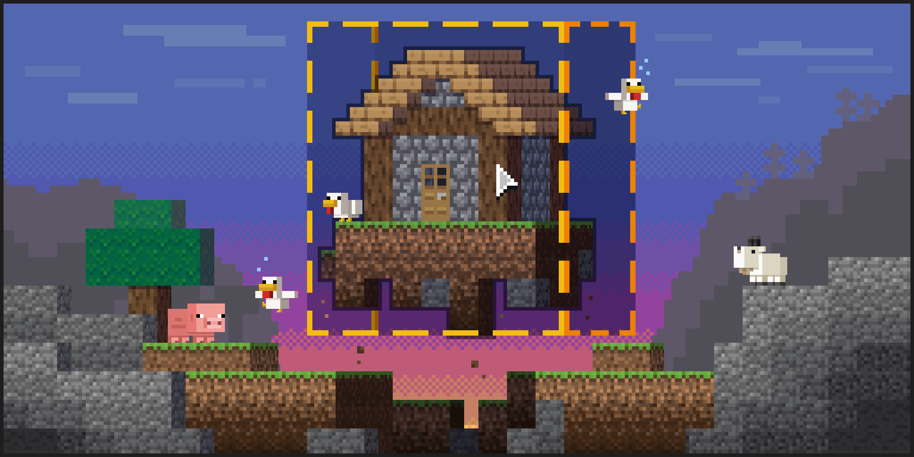
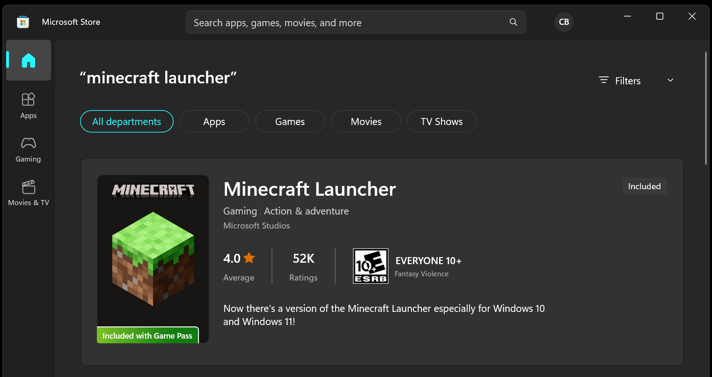
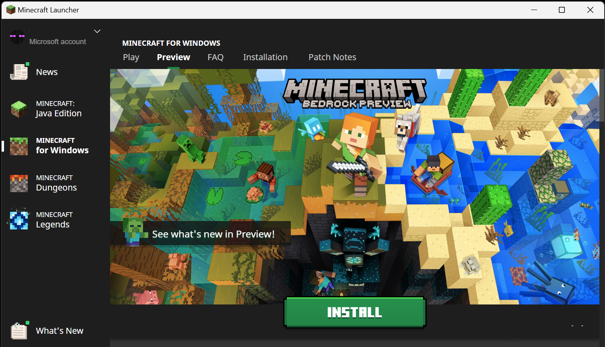
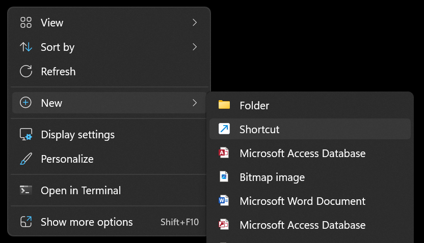
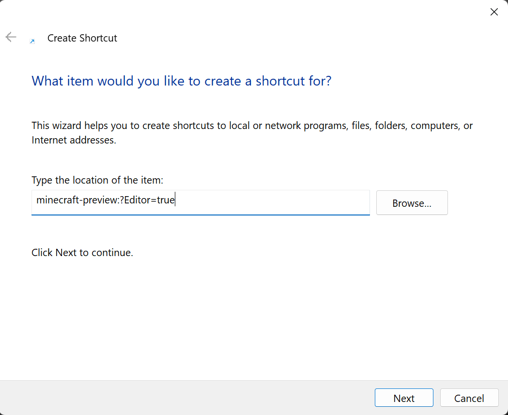
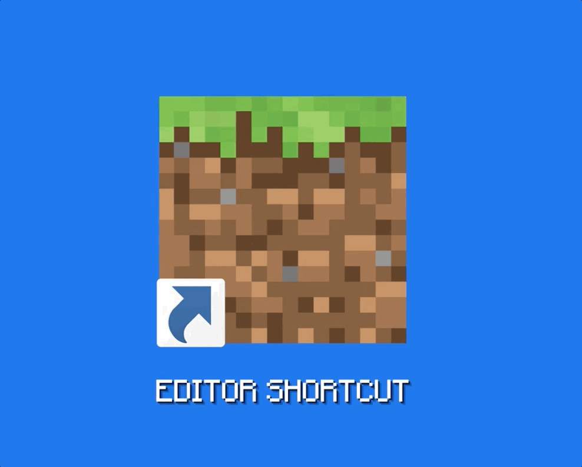
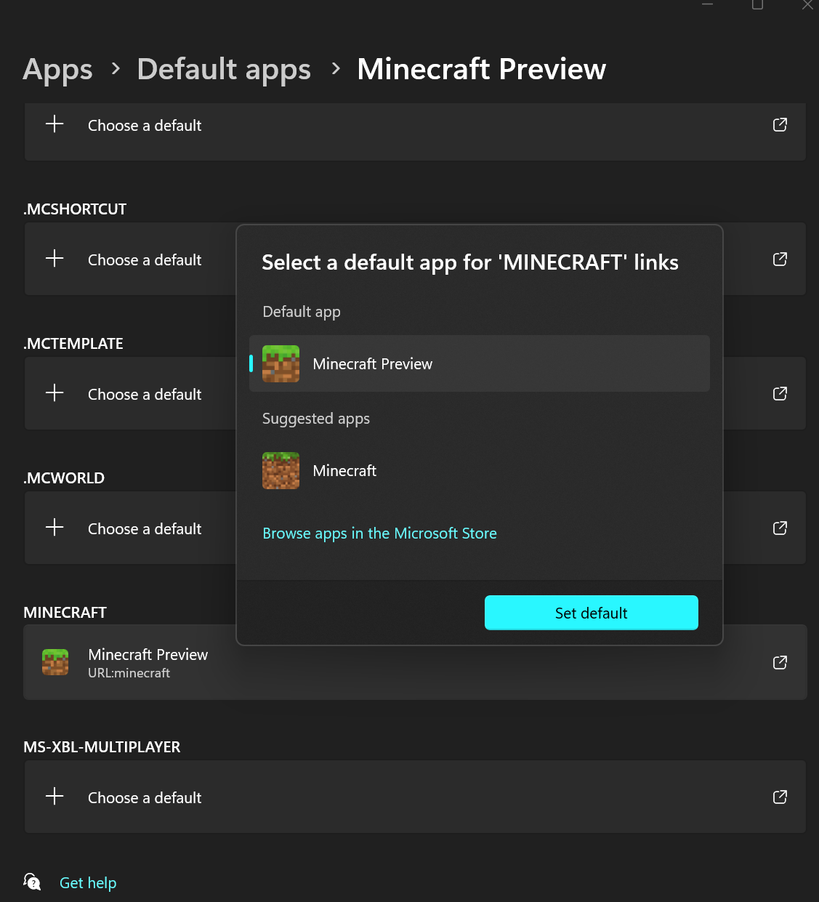
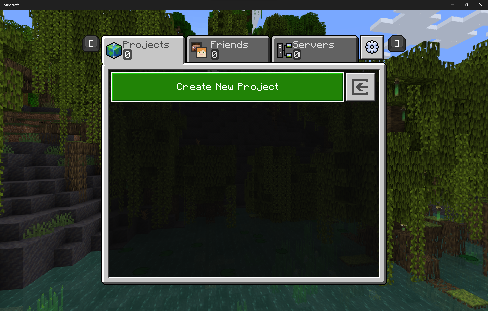

# Welcome to the Minecraft: Bedrock Editor! 

Minecraft Editor is an in-engine, multiblock editing experience focused on making it possible for creators of all skillsets to easily craft high-quality experiences in Bedrock. 

It is a framework that is designed to allow creators to use more complex tools to build, edit, and test worlds than simple gameplay allows. It leverages the game's built-in JavaScript Scripting API in conjunction with a number of native tools built directly into the game itself, to expose a rich environment in which creators can build tools which empower and enhance their editing experience, in the form of "Editor Extensions." 

---

## Housekeeping
- The Editor is in early preview and we're working to add more capabilities. It will change significantly as we get feedback from creators like you.
- Editor will be exclusively available in Bedrock Preview on Windows, keyboard/mouse until the feature set and quality meets our standards.
- Editor is not a new gamemode. It is a tool to assist creators in their worldbuilding workflows.

---

## Development
We are in early development and there is still a lot of work our team has ahead of us. In line with our principles, we want to share early and often with you. We are eager for your feedback and want to work with you to iterate.

---

## Extensibility
We are building an Editor API. While we have iterations to the core Editor experience we want to make, we are also focused on unlocking functionality via the API for you to build your own editing tools -- which we are calling "Extensions." 

v0.4: The Editor API Update was the initial release of the Editor API. Below are supplemental resources to the content in this repo: 

| **Resources** | **Description**|
| -- | -- | 
| [Script API Docs](https://docs.microsoft.com/minecraft/creator/scriptapi/) | Official Microsoft docs for the Creator Scripting API. | 
| [Editor API Docs](https://aka.ms/EditorAPI) | Official Microsoft docs for the Editor API. |
| [Editor Extension Starter Kit](https://github.com/Mojang/minecraft-editor-extension-starter-kit) | A repo containing the build pipeline, libraries, and types required for you to build a Minecraft Editor Extension. | 
| [Editor Extension Samples](https://github.com/Mojang/minecraft-editor-extension-samples) | Extension examples for you to use as a foundation for your own creations, or to learn from. | 

_Note:_ If you are exploring scripting _outside_ of the Editor experience, make sure to enable the "Beta APIs" toggle in Experiments when creating a new world. We also encourage you to proactively brush up on Javascript and Typescript, as that will be the language used for Editor extensions.

---

## Accessing the Editor
Bedrock Editor is for Windows PC, keyboard + mouse only. View the [documentation](https://aka.ms/LearnEditor) to learn more about the Editor. 

**Three-step quick start for getting the Editor:**

1. Install Bedrock Preview via the [Launcher](https://help.minecraft.net/hc/en-us/articles/4412261881229-Minecraft-Launcher-for-Windows-).

| Install the Launcher | Install Bedrock Preview |
|--|--|
|  |  |

2. Create a desktop shortcut. When prompted for the filename, copy/paste the following into the textfield: `minecraft-preview:?Editor=true`

| Create a new shortcut | Specify the destination |
|--|--|
|  |  |

3. Open the Editor via the desktop shortcut you created.

_If your desktop shortcut doesn't appear to be launching the Editor, you may need to change the default app from `Minecraft` to `Minecraft Preview`. View the Troubleshooting section at the end of this README._

---

## Resources 

| **Resource** | **Description** |
|--|--|
| [Documentation](https://aka.ms/LearnEditor) | Learn how to use the Editor | 
| [Minecraft: Bedrock Edition Preview Changelogs](https://feedback.minecraft.net/hc/en-us/sections/360001185332-Beta-and-Preview-Information-and-Changelogs) | View the Preview changelogs |
| [/mojang/minecraft-editor](https://github.com/Mojang/minecraft-editor) | Participate in [discussions and provide feedback to our team](https://github.com/Mojang/minecraft-editor/discussions) | 
| [Editor API Docs](https://aka.ms/EditorAPI) | Official Microsoft docs for the Editor API. |
| [Editor Extension Starter Kit](https://github.com/Mojang/minecraft-editor-extension-starter-kit) | A repo containing the build pipeline, libraries, and types required for a 3rd party to build a Minecraft Editor Extension. | 
| [Editor Extension Samples](https://github.com/Mojang/minecraft-editor-extension-samples) | Extension examples for you to use as a foundation for your own creations, or to learn from. | 

---

## Troubleshooting

If your desktop shortcut doesn't appear to be launching the Editor, you may need to change the default app from `Minecraft` to `Minecraft Preview`. Follow the directions below: 
1. Press `Windows + I` to open the Settings app
2. Select `Apps` and click `Default apps`
3. Search for `Minecraft` and select it
4. Scroll down and find the `MINECRAFT` entry (it should also say `Minecraft | URL:minecraft`) and click it
5. In the pop-up, select `Minecraft Preview` and click ok

| Change default app | What you should see when the Editor launches | 
|--|--|
|  |  |
